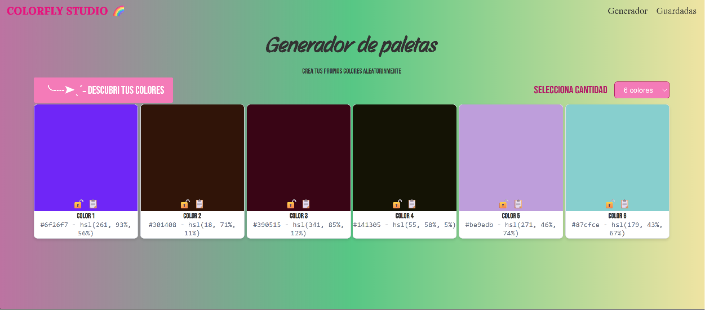
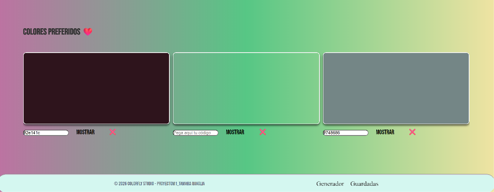

# 🎨 Color Palette Generator

**Proyecto Integrador del Módulo 1 — Soy Henry**
**Autora:** Tamara Quaglia

---

## Índice

1. Descripción General
2. Vista Previa
3. Características
4. Manual de Usuario
5. Decisiones Técnicas
6. Estructura del Proyecto
7. Instalación y Ejecución Local
8. Aplicación Desplegada

---

# Descripción General

Color Palette Generator es una aplicación web desarrollada con HTML, CSS y JavaScript que permite generar paletas de colores aleatorias.

La aplicación permite visualizar los colores en formato HSL y HEX, bloquear colores para conservarlos entre generaciones, copiar códigos al portapapeles y guardar colores favoritos utilizando Local Storage.

---

# Vista Previa

> Reemplazar la imagen por una captura actual de la aplicación.

```md
 
 

```
---

# Características

* 🎨 Generación aleatoria de colores.
* 🔄 Conversión automática de HSL a HEX.
* 🔒 Bloqueo individual de colores.
* 📋 Copiado de códigos HEX al portapapeles.
* 🔢 Selección dinámica de cantidad de colores.
* ❤️ Guardado de colores favoritos mediante Local Storage.
* 📱 Diseño responsive para distintos dispositivos.

---

# Manual de Usuario

## Generar una paleta

1. Seleccionar la cantidad de colores deseada:

   * 6 colores
   * 8 colores
   * 9 colores

2. Presionar el botón **"Descubrí tus colores"**.

3. La aplicación mostrará una nueva combinación de colores aleatorios.

---

## Bloquear colores

Cada tarjeta posee un botón de bloqueo:

* 🔓 Color desbloqueado.
* 🔒 Color bloqueado.

Los colores bloqueados permanecerán sin cambios al generar una nueva paleta.

---

## Copiar colores

Cada tarjeta incluye un botón 📋.

Al presionarlo:

* El código hexadecimal se copia automáticamente al portapapeles.
* Se muestra una confirmación visual temporal indicando que la copia fue realizada correctamente.

---

## Guardar colores favoritos

La sección de favoritos permite:

* Ingresar un color manualmente.
* Visualizarlo inmediatamente.
* Guardarlo de forma permanente en el navegador.
* Eliminarlo cuando ya no sea necesario.

Los colores favoritos permanecen almacenados incluso después de cerrar la página gracias a Local Storage.

---

# Decisiones Técnicas

## Tecnologías Utilizadas

| Tecnología        | Uso                                        |
| ----------------- | ------------------------------------------ |
| HTML5             | Estructura de la aplicación                |
| CSS3              | Diseño visual, layout y responsividad      |
| JavaScript (ES6+) | Lógica de negocio e interacción con el DOM |
| Local Storage API | Persistencia de colores favoritos          |
| Clipboard API     | Copiado de códigos al portapapeles         |

---

## Generación de colores

Los colores se generan aleatoriamente utilizando el modelo HSL (Hue, Saturation y Lightness).

Se eligió este modelo porque permite generar colores variados y fáciles de manipular, facilitando posteriormente su conversión al formato HEX.

```javascript
const h = Math.round(Math.random() * 360);
const s = Math.round(Math.random() * 100);
const l = Math.round(Math.random() * 100);
```

---

## Conversión HSL → HEX

La función `hslToHex()` realiza la conversión matemática del modelo HSL al formato hexadecimal sin utilizar librerías externas.

Esto permite mostrar simultáneamente ambos formatos para cada color generado:

* HSL
* HEX

---

## Estado de la Aplicación

La información de la paleta se almacena en un arreglo global:

```javascript
let paletaActual = [];
```

Cada objeto contiene:

```javascript
{
  colorHSL,
  colorHex,
  locked
}
```

Esto permite conservar el estado de bloqueo de cada color entre generaciones.

---

## Sistema de Bloqueo

El sistema de bloqueo permite mantener colores específicos mientras el resto de la paleta continúa generándose de forma aleatoria.

Cuando un color se encuentra bloqueado, conserva tanto sus valores como su estado dentro de la estructura de datos de la aplicación.

---

## Renderizado Dinámico

Las tarjetas de color se crean completamente mediante JavaScript utilizando:

```javascript
document.createElement()
```

Esto permite adaptar dinámicamente la interfaz según la cantidad de colores seleccionada por el usuario.

---

## Persistencia con Local Storage

Los colores favoritos se almacenan utilizando:

```javascript
localStorage.setItem()
```

y se recuperan automáticamente al cargar la aplicación.

Esto permite conservar la información entre sesiones sin necesidad de backend.

---

# Estructura del Proyecto

```text
ProyectoM1_TamaraQuaglia/
├── IMG IA
│
├── assets
│
├── index.html
│
├── scripts/
│   └── script.js
├── styles/
│   └── styles.css
└── README.md
```
---

# Instalación y Ejecución Local

## Clonar el repositorio

```bash
git clone https://github.com/TamaQuaglia/ProyectoM1_TamaraQuaglia.git
```

## Acceder a la carpeta del proyecto

```bash
cd ProyectoM1_TamaraQuaglia
```

## Ejecutar la aplicación

Abrir el archivo `index.html` en un navegador o utilizar la extensión **Live Server** de Visual Studio Code.

---

# Aplicación Desplegada

### Demo

https://tamaquaglia.github.io/ProyectoM1_TamaraQuaglia/

### Repositorio

https://github.com/TamaQuaglia/ProyectoM1_TamaraQuaglia

---

Proyecto desarrollado como parte del programa de formación Full Stack de Soy Henry.
